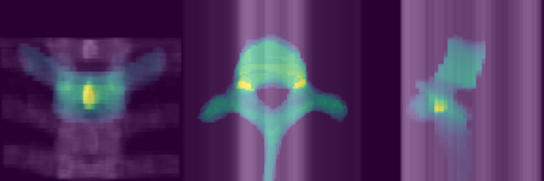
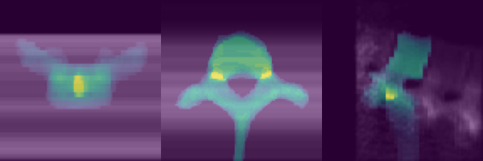

## Orientation Notes

One of the major pain points of setting up a Biplanar X-ray to 3D Segmentation dataset is to maintain orientation of the predicted segmentation and the groundtruth orientation.

Here, we assume that the Biplanar X-ray are in standing left-to-right, anterior-to-posterior orientation.

 
 
The 3D Segmentation volume may be oriented in a defined axcode. When these images go through the model pipeline, we get a 3D segmentation volume. These two groundtruth and predicted volume has to **pixel-aligned** to obtain performance metrics.

The image above shows alignment between projection of 3D segmentation volume and AP(top) and LAT(bottom) images.